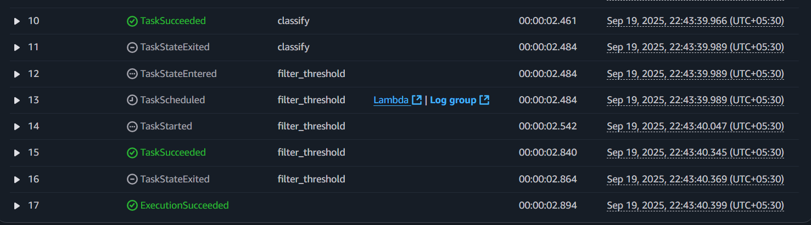
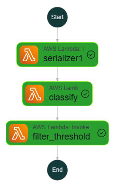
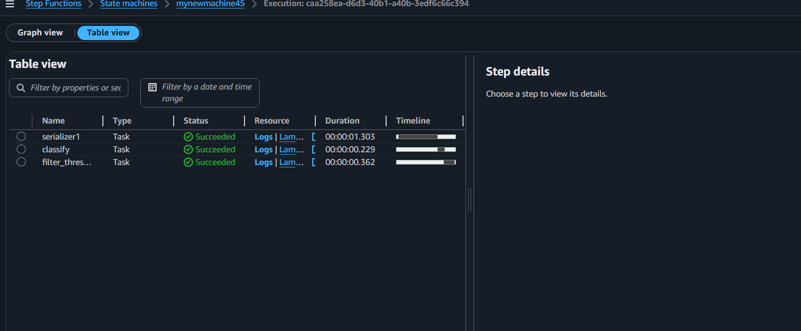

🍪 Udacity AWS MLE Nanodegree – Project 2
🚀 Build & Deploy a Machine Learning Workflow for Scones Unlimited on Amazon SageMaker

The goal of this project was to design, build, and deploy an image classification workflow for Scones Unlimited, a logistics company specializing in scone delivery, using AWS SageMaker, Lambda, and Step Functions.

📌 Project Title

Deploy and Monitor a Machine Learning Workflow for Image Classification Using Amazon SageMaker
Source: AWS Machine Learning Engineer Nanodegree Scholarship Program

📝 1. Overview

This project was developed as part of the AWS x Udacity Machine Learning Engineer Nanodegree Scholarship Program.

We built a serverless ML workflow that automates:

✅ Data Serialization

✅ Model Inference

✅ Confidence Filtering

✅ Monitoring & Deployment

All integrated seamlessly with AWS Step Functions.

📂 2. Project Files
File	Description
Project2_Build-a-ML-Workflow-For-Scones-Unlimited-On-Amazon-SageMaker.ipynb	Jupyter Notebook showing end-to-end ML workflow – preprocessing, training, deployment, monitoring.
Project2_Build-a-ML-Workflow-For-Scones-Unlimited-On-Amazon-SageMaker.html	Static HTML export of the above notebook.
Lambda.py	Collection of Lambda handler scripts (serialize.py, classify.py, filterthresh.py) used in the Step Functions workflow.
Screenshot-of-Working-Step-Function.PNG	Screenshot of the successfully executed workflow.
step-function.json	Exported AWS Step Functions definition in JSON format.
⚙️ 3. Dependencies

Jupyter Kernel: Python 3 (Data Science) – v3.7.10

SageMaker Instance: ml.t3.medium

AWS Lambda Runtime: Python 3.8

💻 4. Installation

For local development & exploration:

Install Jupyter Lab:

pip install jupyterlab

Start Jupyter Lab:

jupyter lab

Alternatively, use Jupyter Docker Stacks
 for a containerized setup.

🔎 5. Approach

We designed a modular ML pipeline using Lambda + SageMaker + Step Functions:

🔹 5.1 AWS Lambda Functions

Serialize Image Data

serialize.py

Reads image address from S3, serializes it into a JSON payload.

Image Classification

classify.py

Sends serialized image data to the deployed SageMaker endpoint.

Collects inference results as JSON.

Filter Low Confidence Inferences

filterthresh.py

Filters predictions based on a confidence threshold, passing only reliable inferences forward.

### 🔹 5.2 Step Functions Workflow  

#### 🛠 Execution Flow  

   
  <em>Execution Flow of the Step Function</em>

#### 📊 Step Function Graph  

   
  <em>Step Function Graph</em>

#### ✅ Successful Run  

   
  <em>Step Function Successfully Executed</em>

🎯 6. Key Learnings

How to deploy ML models using SageMaker endpoints.

How to connect AWS services (Lambda + Step Functions + SageMaker).

Building modular serverless workflows for production ML.

Setting up confidence-based inference filtering.

🏆 7. Conclusion

This project successfully demonstrates the use of AWS cloud-native tools to automate a real-world ML workflow. The modular design makes it scalable, maintainable, and production-ready for logistics companies like Scones Unlimited.

✨ Part of the AWS x Udacity MLE Nanodegree Scholarship Program
